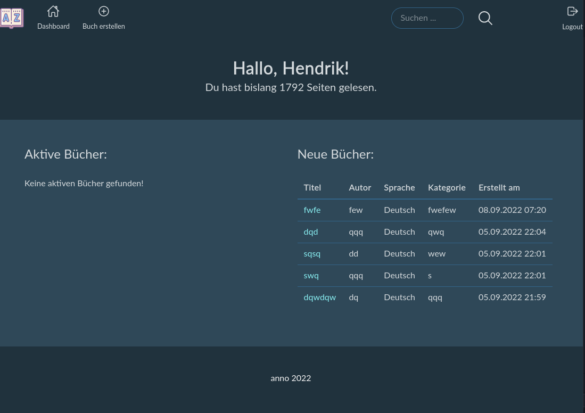

# liberator

## Description

`liberator` is a small web app to keep track of your books. It supports

- adding books
- viewing books
- search books via `title` and `author`
- show some stats on the dashboard

## Screenshot



## Host it yourself

### Prerequisites

`liberator` is developed and tested on Go `1.19`.
You can use the [instructions from go.dev](https://go.dev/doc/install).

If you want to use the `Makefile`, you need `make`. On Ubuntu-based distributions you can install `make` via `apt`:

```bash
sudo apt update
sudo apt install build-essential
```

If you also want to customize the CSS later on, you will also need [npm](https://nodejs.org/en/download/).

### Building

Clone the sources and run the following command:

```bash
go run ./cmd/web -port=5000
```

The used network port can be specified with the argument port.

## Customize

You can customized the sass-file in `internal/assets/liberator.sass` and regenerate the CSS files.

Using `Makefile`

```bash
make css/generate
```

Using `npm`

```bash
npm run css-build
```

## Status

`liberator` only supports the bare minimum.
Missing functions and bugs are logged as issues.
If you need anything or have any ideas, please log them under issues.

## Credits

- [Lets Go](https://lets-go.alexedwards.net/)
- [Bulma.io](https://bulma.io/)
- [Ionicons](https://ionic.io/ionicons)


## Contributing to liberator
To contribute to `liberator`, follow these steps:

1. Fork this repository.
2. Create a branch: `git checkout -b <branch_name>`.
3. Make your changes and commit them: `git commit -m '<commit_message>'`
4. Push to the original branch: `git push origin liberator/develop`
5. Create the pull request.

Alternatively see the GitHub documentation on [creating a pull request](https://help.github.com/en/github/collaborating-with-issues-and-pull-requests/creating-a-pull-request).

## Contact

If you want to contact me you can reach me at [hendrik@hr94.de](mailto:hendrik@hr94.de?subject=liberator).

## License

This project uses the following license:  [GNU GPLv3](https://spdx.org/licenses/GPL-3.0-or-later.html).